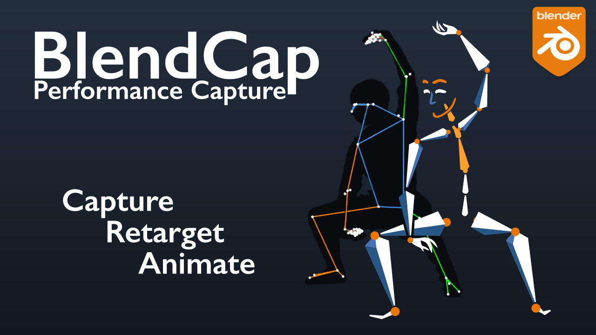
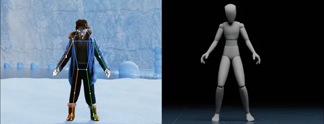
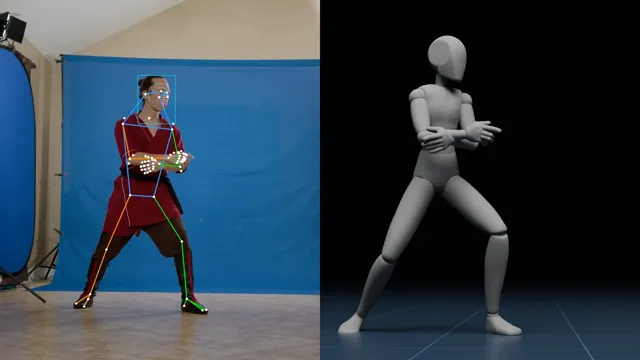
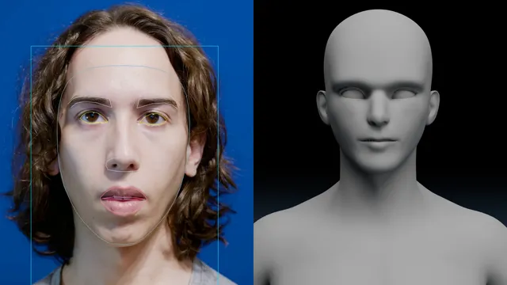
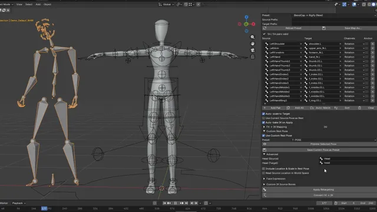
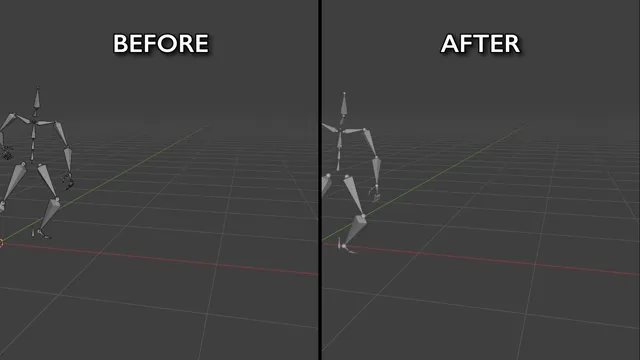
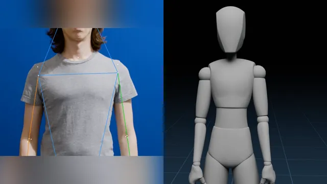
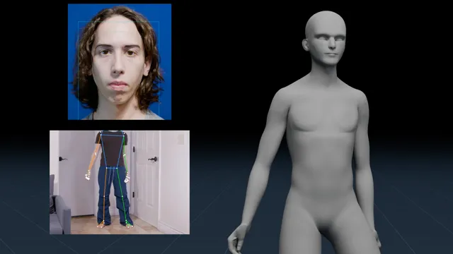
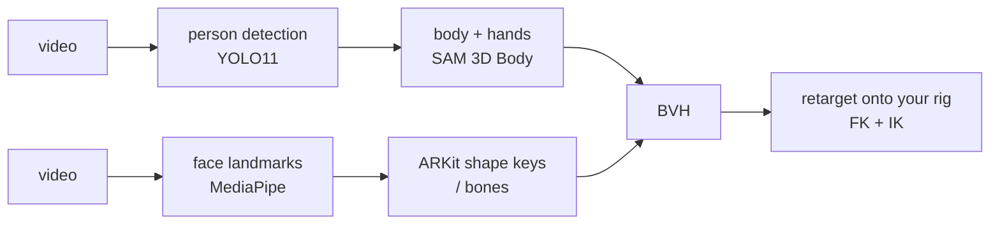

<!--
  README for github.com/Arcomade/BlendCap — the PUBLIC SOURCE repo's landing
  page. Not the marketplace docs (../documentation/) and not the in-product help.
  Images in assets/ are copies of the product-page assets (same filenames as
  superhive-page/images — update both when a render changes). Before
  publishing: fill the social placeholder, and paste the
  documentation pages + their images/ folder from ../documentation/ into a
  docs/ folder in the repo (the README links there; no staged copy is kept
  in this folder by choice).
-->

# BlendCap

### Markerless performance capture for Blender: video in, animation out.

---

BlendCap reconstructs a full **performance**, body, hands, and face, from an ordinary video and retargets it onto your Blender rig. No motion-capture suit, no markers, no special hardware, and no second camera. Record on a phone or use footage you already have.

> ### About this repository
>
> This is the **public source repository** for the BlendCap add-on, published so the source is available as its license requires (BlendCap is GPL-3.0-or-later and includes the AGPL-3.0 YOLO11 detector, see [Licensing](#licensing)).
>
> **Most people want the [paid build](#get-blendcap)**: it adds the one-click dependency installer, bundled model access so the setup just works, updates, and support. Building from this source yourself is possible but **advanced and unsupported**, there are no install scripts here by design; the requirements and model sources are documented in [`requirements.txt`](requirements.txt).

---

## Contents

- [Features](#features)
- [See it in action](#see-it-in-action)
- [Requirements](#requirements)
- [Get BlendCap](#get-blendcap)
- [Documentation](#documentation)
- [How it works](#how-it-works)
- [Roadmap](#roadmap)
- [Licensing](#licensing)
- [Acknowledgements](#acknowledgements)

---

## Features

- **Single-camera, markerless capture**: full body **and** hands from one ordinary clip.
- **Finger tracking**: both general hand shape tracking and full finger pose tracking, with dedicated controls to tune finger curl or rebuild the finger motion from the tracked keypoints.
- **Facial performance capture**: drives ARKit-style shape keys and face bones, captured from the same clip or its own.
- **Retarget onto your rig**: Rigify, Auto-Rig Pro, CloudRig, Mixamo and custom rigs, in both **FK and IK**, with included presets and a visual bone-map editor.
- **Capture cleanup built in**: foot grounding and locking, depth-noise filtering, smoothing, tracking-failure repair, and per-take camera-angle correction.
- **Runs fully offline** after setup, your footage never leaves your machine.
- **GPU-accelerated** on NVIDIA, with experimental AMD/Intel paths and a CPU-only fallback.

## See it in action

| Body capture | Face capture |
|:---:|:---:|
|  |  |
| Ordinary clip → retargeted character | Face clip → facial animation, combined with the body |

|                      Retargeting                      |                    Post-processing                     |
| :---------------------------------------------------: | :----------------------------------------------------: |
|  |  |
|     Finished motion transferred to any other rig      | The clip's full post-processing pass, before and after |

|                 Finger tracking                 |          Combined body & face capture           |
| :---------------------------------------------: | :---------------------------------------------: |
|  |  |
|            Full finger pose tracking            |     Separate body and face clips, combined      |

> **Watch the feature demo:** [YouTube](https://www.youtube.com/watch?v=hOW8U1goY8g)

## Requirements

| | |
|---|---|
| **Blender** | 4.2 or newer |
| **OS** | Windows 10/11 (fully supported) · Linux, including Flatpak Blender (supported) · macOS (not supported) |
| **GPU** | NVIDIA RTX 20 / GTX 16 series or newer, 6 GB+ VRAM recommended. AMD/Intel experimental; CPU-only fallback available (slow). |
| **Disk / network** | ~32 GB free for models + dependencies; internet needed once for the ~11 GB setup download. Capture itself runs offline. |

See the full [system requirements](#documentation) in the documentation for the GPU tiers and the CPU-only fallback.

## Get BlendCap

The easiest way to use BlendCap is the **paid build**: install it in Blender and click once. It handles everything to get you up and running quickly and effortlessly:

- One-click dependency installer (no terminal, no manual Python)
- Bundled model access, so the ~11 GB setup just works
- Updates and support
- Validated on Windows and Linux with NVIDIA GPUs, experimental support on non-nvidia windows and Linux.

### → [**Get BlendCap on Gumroad**][store-link] ←

<!-- Superhive (Blender Market) listing is under review. When it goes live,
     uncomment the next line to add a second button: -->
<!-- ### → [**Also on Superhive (Blender Market)**][superhive-link] ← -->

[store-link]: https://arcomade.gumroad.com/l/BlendCap
<!-- [superhive-link]: https://superhivemarket.com/products/blendcap -->

## Documentation

Full documentation, installation, a first-capture quick start, every setting, and filming tips, lives in [`docs/`](docs/) in this repository, start at the [table of contents](docs/README.md).

<!-- docs/ = paste ../documentation/'s pages + images/ here when publishing
     (relative links render on GitHub as-is). When the website goes live,
     point this section there instead. -->

## How it works

BlendCap runs Meta's **SAM 3D Body** (a 127-joint body+hand model with a **DINOv3** vision backbone, plus **MoGe** for camera field-of-view) to reconstruct the body, and **MediaPipe** for the face. Inference is accelerated by the **Fast-SAM-3D-Body** library on **PyTorch** / **ONNX Runtime**. The result is exported as a BVH and retargeted onto your character.

Where it lives in the source: capture runs in [`save_mhr_data.py`](save_mhr_data.py) / [`save_face_data.py`](save_face_data.py); the post-processing passes (foot grounding, depth-noise filtering, hand solving, tracking-failure repair, face refinement) in [`pipeline/`](pipeline/); and the retargeting engine (FK bake, IK conversion, constraint simulation, bone-map matching) in [`blendcap/retarget/`](blendcap/retarget/).

## Roadmap

Directions actively being worked toward, not dated promises, priorities shift with feedback:

**Planned**
- **More rig presets** — ready-made bone maps for other popular rigs.
- **Smarter auto-match** — better automatic bone matching in the map editor, so custom rigs won't need as much manual input.
- **Multi-person capture** — track more than one performer in a shot and split them onto separate armatures.
- **Resumable captures** — pause and continue a long capture, and recover a crashed run instead of starting it over from scratch.

**Exploring**
- **Remote GPU capture** — run capture on your own cloud GPU when you don't have a local NVIDIA card ("bring your own pod").
- **Audio-assisted lip-sync** — use the clip's audio to sharpen mouth shapes during speech.
- **Dedicated hand capture** — film the hands up close for finer finger detail and combine it with a wider body shot, the way separate face capture already works.

## Licensing

BlendCap is licensed **GPL-3.0-or-later**. © 2026 Arcomade. See [`LICENSE`](LICENSE) and [`NOTICE.txt`](NOTICE.txt).

Because BlendCap includes the **AGPL-3.0** Ultralytics YOLO11 detector as a core, always-loaded component, the whole add-on is distributed under GPL v3 (which bridges to the AGPL component under section 13), which is why this source is, and must remain, public.

Bundled / redistributed components keep their own licenses; full texts are in [`licenses/`](licenses/):

| Component | Role | License |
|---|---|---|
| Meta SAM 3D Body | Body + hand model | Meta SAM License |
| Meta DINOv3 | Vision backbone | Meta DINOv3 License |
| Ultralytics YOLO11 | Person detection | AGPL-3.0 |
| Fast-SAM-3D-Body | Accelerated inference | MIT (over Meta-SAM code) |
| MoGe (Microsoft) | Camera field-of-view | MIT (+ Apache-2.0 subcomponent) |
| MediaPipe (Google) | Facial landmarks | Apache-2.0 |
| ICT-FaceKit (USC ICT) | Face expression basis (derived data asset) | MIT |
| PyTorch / ONNX Runtime | Runtimes | BSD-3-Clause / MIT |

> The **animation you create** with BlendCap is yours to use, including commercially. The SAM License permits commercial use royalty-free; you're responsible for having the rights to the footage you capture.

## Acknowledgements

BlendCap stands on the work of these projects and the teams behind them:

- [SAM 3D Body](https://github.com/facebookresearch/sam-3d-body) (Meta)
- [DINOv3](https://github.com/facebookresearch/dinov3) (Meta)
- [Fast-SAM-3D-Body](https://github.com/yangtiming/Fast-SAM-3D-Body)
- [YOLO11 / Ultralytics](https://github.com/ultralytics/ultralytics)
- [MoGe](https://github.com/microsoft/MoGe) (Microsoft)
- [MediaPipe](https://github.com/google-ai-edge/mediapipe) (Google)
- [ICT-FaceKit](https://github.com/USC-ICT/ICT-FaceKit) (USC Institute for Creative Technologies)
- [PyTorch](https://pytorch.org/) · [ONNX Runtime](https://onnxruntime.ai/)
- …and [Blender](https://www.blender.org/) and its community.