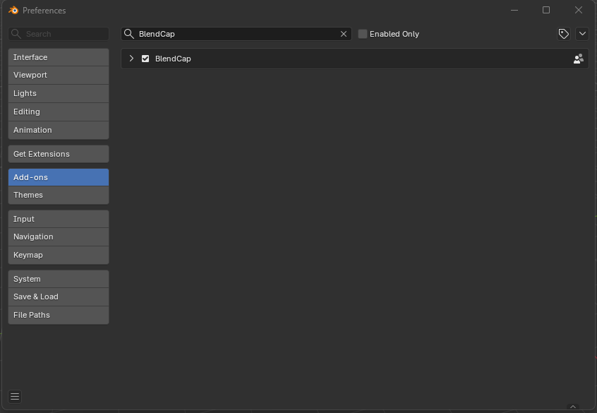
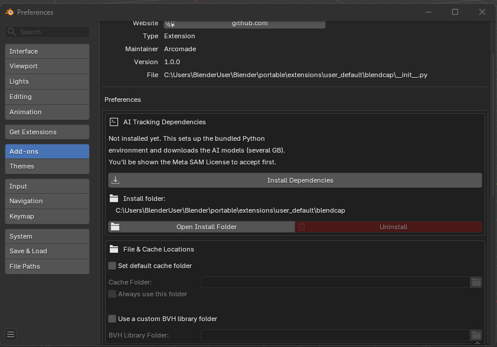
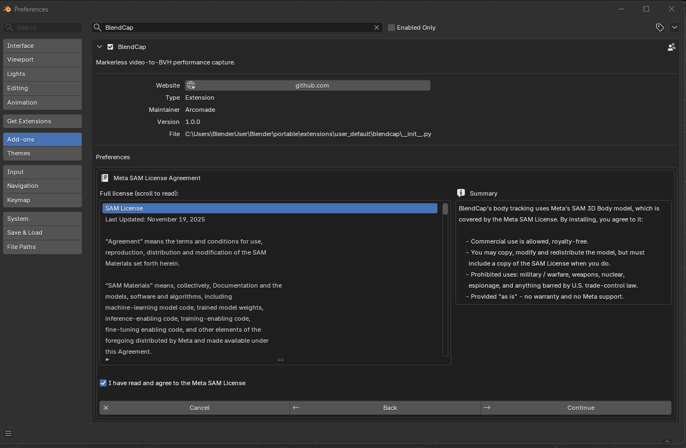
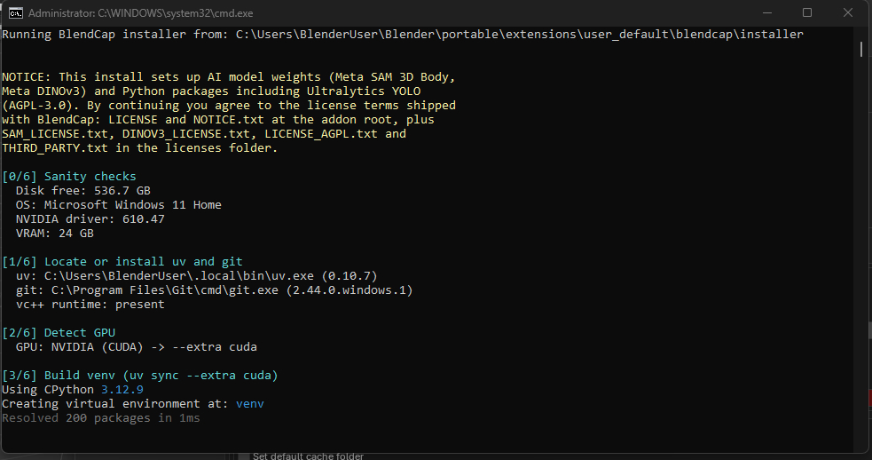

# Installation

---

## Step 1: Install the add-on

1. In Blender, open **Edit ▸ Preferences ▸ Get Extensions** (or **Add-ons**).
2. Use **Install from Disk** and select the BlendCap `.zip` file you downloaded.
3. Enable **BlendCap** in the list if it isn't enabled automatically.

Once enabled, you'll find BlendCap in the **3D Viewport sidebar** (press **N**) under the **BlendCap** tab, as well as in the "**Output**" tab in the **Properties editor**.

---

## Step 2: Install the dependencies

The first time, BlendCap needs to download the models and the libraries that run them (around **11 GB**). This is a one-time setup.

1. If the Preferences window isn't already open, go to **Edit ▸ Preferences ▸ Add-ons**, find **BlendCap**, and expand it. (You can also reach this faster with the **Open Preferences** button in the **Setup** section of BlendCap's sidebar panel.)
2. Click **Install Dependencies**.
   

3. An **install guide** appears, right inside the preferences panel. Read the intro, then review and **accept the model license** (Meta's SAM License), you need to scroll through it and tick the agreement box to continue.
   

4. The next page lists the small system tools BlendCap may install for you if they're missing (a package manager helper, Git, and on Windows the Microsoft Visual C++ runtime). Click **Install** to begin. If any of them need to be installed, your system may ask for permissions in order to install them.
5. The installer opens a terminal window where you can watch its progress. It will alert you to any errors or extra instructions if needed.
   

6. When it finishes, the terminal window will say "INSTALL COMPLETE" and BlendCap will be ready to capture.

### How long does it take?
Mostly it depends on your internet speed, you're downloading about 11 GB. On a fast connection it's typically several minutes; on a slow one, longer. If the download is interrupted, just run it again, it resumes where it left off rather than starting over.

---

## Platform notes

### Windows
The installer can set up everything a clean machine needs, it will fetch the few system tools it depends on automatically. You don't need Python or any developer tools installed beforehand. If a standard Microsoft component is missing, Windows asks for permissions once in order to install it.

If a tool can't be fetched on your system, the installer tells you exactly which component to install and where to get it.

### Linux
On Linux the installer opens a visible terminal so you can follow along. Installing some system tools may ask for your password (via `sudo`). Both standard and **Flatpak** Blender are supported.

> **Flatpak Blender, one-time permission.** Because Flatpak runs Blender in a sandbox, BlendCap needs permission to run its installer on the host system. If this permission is missing, the install guide shows the exact command to run, with a **Copy** button. Run it once, restart Blender, and you're set.

---

## Reinstalling and uninstalling

Both live in the BlendCap section of **Add-on Preferences**:

- **Reinstall Dependencies**: re-runs the dependency setup. Useful after a GPU change or if an install was interrupted.
- **Uninstall**: removes the downloaded models and libraries to free up disk space. It asks you to confirm first. (This removes the dependencies, not the add-on itself, disable or remove the add-on through Blender's Add-ons list.)

There's also an **Open Install Folder** button if you ever want to see where things live on disk.

---

## Verifying the install

The quickest way to confirm everything works:

1. Load a short test video (see [Quick Start](04-quick-start.md)).
2. Run a **Preview**: it should detect the person across the clip in a few seconds.

If Preview finds your subject, your capture path is working. If anything goes wrong, see [Troubleshooting & FAQ](12-troubleshooting-and-faq.md).
