# Quick Start

This page walks through one complete capture, from a video file to animation on your rig. Once you've done it once, the rest of the documentation fills in the details and options.

> **Before you start:** make sure you've completed both steps on the [Installation](03-installation.md) page, the add-on is enabled **and** the dependencies are installed.

---

## 1. Open BlendCap

In the 3D Viewport, press **N** to open the sidebar and click the **BlendCap** tab.

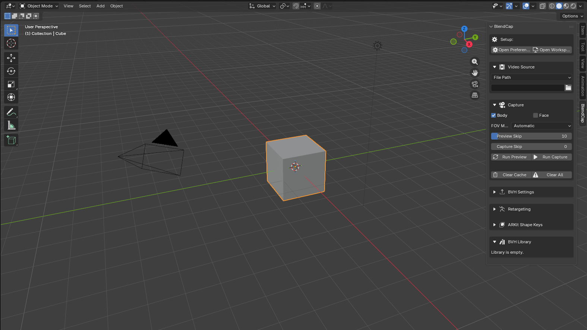

## 2. Choose your video

In the **Video Source** section, leave it on **File Path** and point BlendCap at a video file on disk.

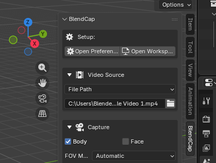

>**Tips for a good first clip:** The video should only show one person, fully in frame, with reasonably good lighting, and a steady camera. See [Filming Tips](13-filming-tips.md) for more.
>
>BlendCap can also pull footage from Blender's Video Sequencer for editing and multi-clip work. See [Capturing](05-capturing.md) for details.

## 3. (Optional) Run a Preview

Before committing to a full capture, you can optionally click **Run Preview**. Instead of processing every frame, BlendCap will check a sample of frames across the clip and draw a box on each where it finds a person, so you can confirm your subject is detected from start to finish. Because it only samples frames and just detects the person rather than solving the full pose, it is far quicker than a full capture. How densely it samples is set by **Preview Skip** (covered in [Capturing](05-capturing.md)).

> Preview confirms the person is *detected* across the clip. It doesn't show the final pose quality, that comes from the full capture in the next step.

## 4. Capture

In the **Capture** section, choose what to track:

- **Body**: full body and hands.
- **Face**: facial performance (can be combined with Body, or done on its own).

Click **Run Capture**. BlendCap processes the clip and loads a plane in the viewport showing the tracked 2D skeleton over your footage, so you can check the result before going further.

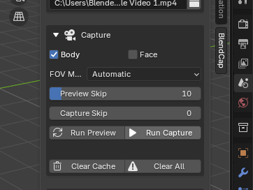

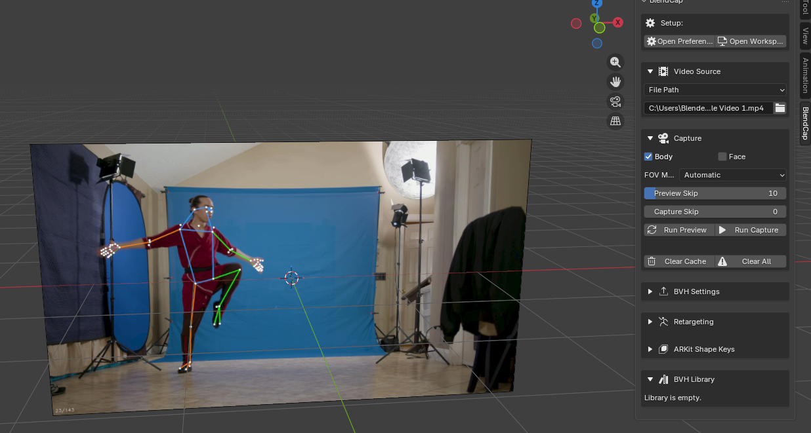

Once you're done examining the capture results, you can safely hide or delete the preview plane to clear up your viewport.

## 5. Generate the armature

Expand the **BVH Settings** section and click **Generate/Reload BVH**. BlendCap converts the capture into an animated armature and imports it into your scene, ready to retarget.

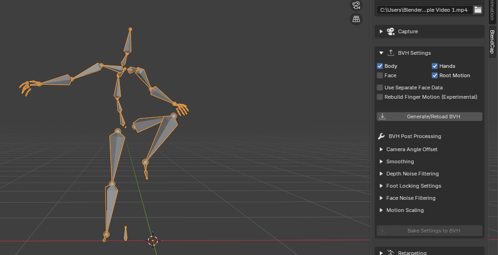

Your captured motion is now ready to use. If anything looks off, you can refine it with the **BVH Post Processing** controls (see [BVH Generation and Post-Processing](08-bvh-generation-and-post-processing.md)).

From here you have two options:

- **Export it** to use in another program, covered in [BVH Library & Cache](10-bvh-library-and-cache.md).
- **Retarget it onto a rigged character in Blender**, covered in the steps below. First make sure your rigged character is in the scene, either by importing it or by opening the project file that already has it.

> **Heads up:** an unsaved project keeps its capture in a temporary cache that does not carry over to another project and is wiped when Blender closes. So before you exit, save this project if you plan to move the capture into another project file, or export the result (see [BVH Library & Cache](10-bvh-library-and-cache.md)). Otherwise the capture is lost when you leave. Even if you're staying in this project, it's worth saving anyway, so a crash doesn't force you to run the capture process again.

## 6. Point BlendCap at your rig

Now transfer the captured motion onto your character. In the **Retargeting** section:

1. Set **Source** to the armature you just generated.
2. Set **Target** to your character's rig (Rigify, Auto-Rig Pro, CloudRig, a Mixamo-style rig, or your own).

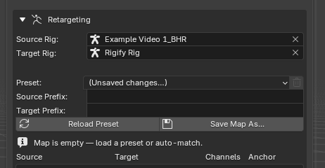
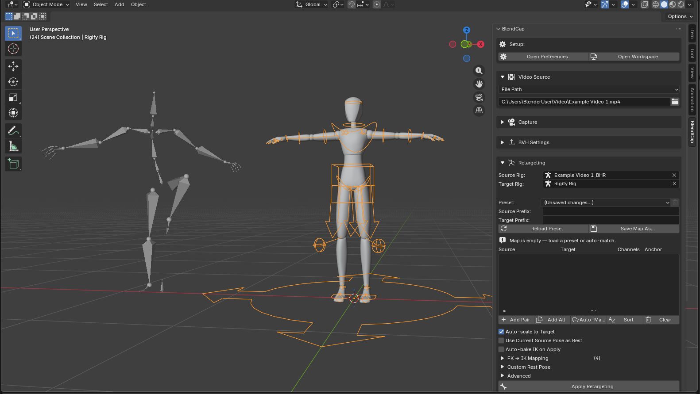

## 7. Load a bone map

BlendCap needs to know which captured bone drives which bone on your rig. The easiest path:

- **Choose a preset** that matches your rig type from the preset list, **or**
- Click **Auto-Match** to let BlendCap attempt to pair the bones automatically based on naming, or **Add All** to fill the map, and pair the bones manually.

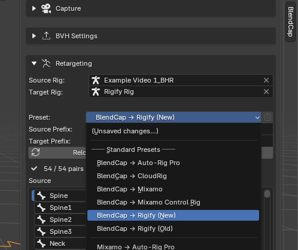

You can fine-tune any pairing by hand, see [Retargeting](09-retargeting.md).

## 8. Match the rest pose

Retargeting is cleanest when the source armature and your character start from the same rest pose, so line them up before baking.

- **If your character is in a simple T-pose** (like the example), open the **Custom Rest Pose** section, enable it, and pick the **T-POSE** preset. No manual posing needed.
- **For any other pose, match it by hand.** In **Pose Mode** on the source armature, clear its transforms, pose it to match your character's rest pose, then enable **Use Current Source Pose as Rest**. You can also save any manual pose as your own Custom Rest Pose preset for future use.

This only sets what BlendCap treats as the source's rest pose; it doesn't change your captured animation. See [Retargeting](09-retargeting.md) for more.

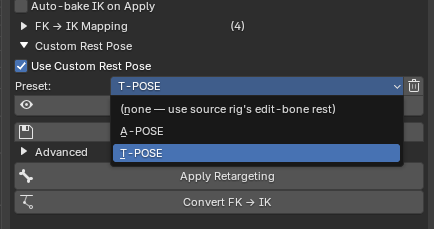

## 9. Retarget

Click the "Apply Retargeting" button. BlendCap will transfer the motion onto your rig's FK controls. Once it's finished, scrub across the timeline and you should see your character performing the clip.

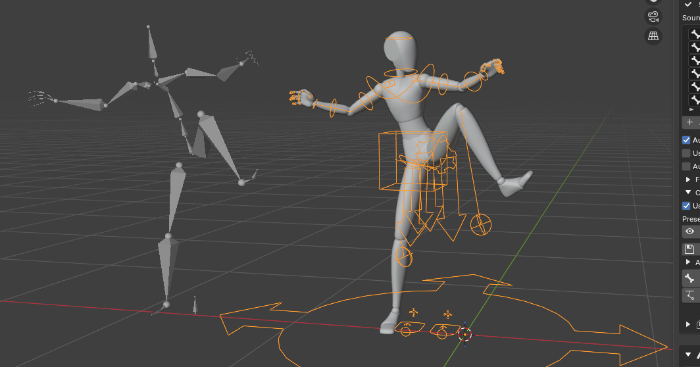

## 10. (Optional) Convert to IK

If your rig includes IK arms and legs, BlendCap can convert the FK motion to IK so you get clean foot and hand control for editing. If you used one of BlendCap's bundled preset maps, just click **Convert FK → IK** and BlendCap handles the conversion for you; otherwise you will need to set up the IK targets manually before converting. See [Retargeting](09-retargeting.md) for more details.

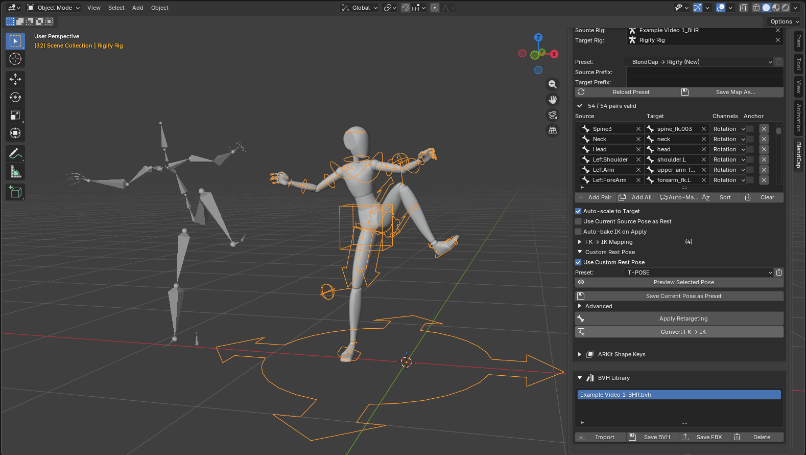

## 11. Polish to taste

Your character is now animated with the captured motion, on its own FK (and, if you converted them, IK) controls. From here it is a normal Blender animation, so you can refine it by hand like any other: clean up keyframes, smooth rough moments, or adjust individual poses until it is the final result you want. The IK controls from the previous step make foot and hand fixes much easier.

If it already works for your shot, leave it as is. (Capture-level problems like footskate or overall jitter are often best fixed back in **BVH Post Processing** rather than by hand, see [BVH Generation and Post-Processing](08-bvh-generation-and-post-processing.md).)

---

## That's a capture!

From here:

- Learn the capture options in detail → [Capturing](05-capturing.md)
- Get the cleanest possible motion → [BVH Generation and Post-Processing](08-bvh-generation-and-post-processing.md)
- Master retargeting and custom rigs → [Retargeting](09-retargeting.md)
- Add facial performance → [Face Capture](06-face-capture.md)
- Add high-detail hand motion → [Hand Tracking](07-hand-tracking.md)
