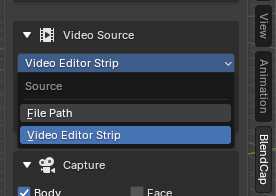
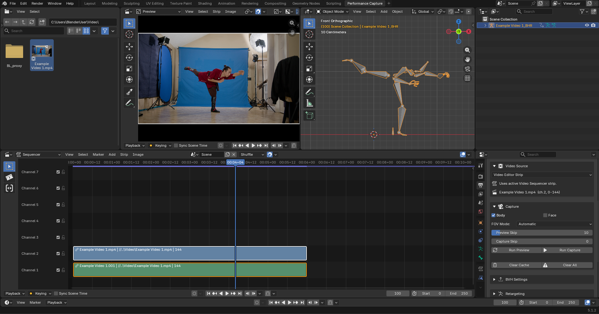
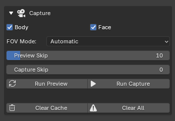
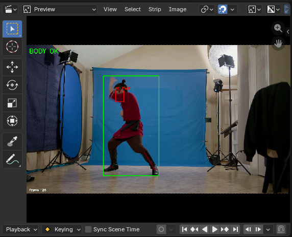
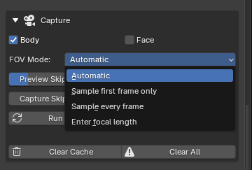

# Capturing

This page covers the capture step: choosing your footage, the capture options, and the preview.

A capture does **not** produce the final armature. Its output is the raw tracking data (an **NPZ** file) plus a preview overlay so you can check the result. Turning that into an animated armature (a **BVH**) is a separate step, covered on the [BVH Generation and Post-Processing](08-bvh-generation-and-post-processing.md) page. From there you retarget the armature onto your character (see [Retargeting](09-retargeting.md)).

---

## Video Source

In the **Video Source** section you tell BlendCap where the footage is:

> **Note:** You can set which source BlendCap starts on when you open Blender using the **Default Source** preference (see [Preferences](11-preferences.md)).

- **File Path**: a video file somewhere on your computer. The simplest path, and all you need for a single clip. Point the field at the file and you're set.
- **Video Editor Strip**: capture from the active strip in Blender's Video Sequencer. Use this when you want to edit footage before capturing, or work with more than one clip (see Working in the Sequencer below).

> **Sequencer render setting:** when you set the Video Source to **Video Editor Strip**, BlendCap offers to turn off the Video Sequencer's render output so your capture footage doesn't show up in your final renders. You can change whether it asks, disables it automatically, or leaves it alone with the **Sequencer Render Warning** preference (see [Preferences](11-preferences.md)).

### Frame rate
BlendCap works best when the capture video's frame rate matches your scene's. If it detects a mismatch, it offers to convert the footage to your project's frame rate before capturing. The conversion keeps the clip's real-time duration, dropping or duplicating frames as needed so the performance still plays at the same speed and the captured timing stays correct. You can generally accept the conversion safely, unless you would rather scale the captured animation's keyframes yourself after importing it into Blender.

>Note that when you drop your first clip into Blender's Video Sequencer, Blender sets the project frame rate to match that clip. This is Blender's own behavior, and there is currently no way to turn it off, but you can change the rate afterward in **Output Properties ▸ Frame Rate** if you prefer to work in a specific framerate.

### Working in the Sequencer
Click **Open Workspace** in the **Setup** section to load BlendCap's **Performance Capture** workspace: a ready-made layout with Blender's Video Sequencer and the 3D viewport set up side by side. BlendCap's capturing tools are built around this workspace, so you will find everything you need for a capture available here. If you would like to have this workspace ready in every new project, you can save it into Blender's startup file (see [Preferences](11-preferences.md)).

With a clip on the timeline and **Video Editor Strip** chosen as the Video Source, BlendCap captures from the **active strip**. The panel shows the active strip's name and frame range, or warns you when no strip is selected. Working this way adds a few things the plain File path can't:

- **Edit before you capture.** Trim, cut, or rearrange the strip first. BlendCap captures the strip's visible range, so you can isolate just the part you want without altering the original file or exporting a separate edited copy.
- **Work with separate body and face clips.** If you recorded the body and face performances as different clips, you can place both on the timeline and trim them to line up the performances before capturing. You don't need to match up head movement between them, the head comes entirely from the body clip.

> **Proxy clips:** edits to a BlendCap proxy strip don't carry back to the original. When the active strip is a proxy, the panel shows a **Revert to Original Video** button and a reminder, so revert first if you need to re-edit after running a capture.

---

## What to capture: Body and Face

The **Capture** section has two toggles:

- **Body**: full-body and hand tracking.
- **Face**: facial performance (see [Face Capture](06-face-capture.md)).

You can capture both together from one clip, or either on its own from separate clips. Hands always come with the body, capturing them from their own separate clip isn't supported yet, though it's being explored for a future release.

---

## Run Preview

**Run Preview** does a fast pass over the clip, checking a sample of frames rather than all of them, and marking whether it found a person on each. It runs only the lighter person detector, not the full pose model, so it is far quicker than a capture. It answers one question before you commit to a full capture: *is my subject reliably detected throughout the clip?* Preview confirms detection coverage, not final pose quality, which comes from the capture itself.

- A **green box** means the person was found on that frame. The box interpolates between checked frames to give a rough estimation of the motion.
- A **red marker** means no person/face was detected.
- A few red markers don't necessarily mean the capture will fail. BlendCap can often interpolate across the missing frames and still produce a clean animation.

By default **Preview Skip** is set to 10, so it checks roughly one frame in ten. Raise it to scan faster (fewer frames), or lower it toward 0 to check more frames for a more accurate survey (at 0 it checks every frame). The more frames you check, the longer the preview will take to process.

Once you've finished examining your preview footage, you can run a full capture straight away. If you're working in the Sequencer and want to edit more before capturing, revert the strip first by clicking **Revert to Original Video** with the preview strip selected.

If you see lots of misses, fix the footage (framing, lighting, occlusion) before capturing, see [Filming Tips](13-filming-tips.md).

---

## Capture options

These controls let you trade quality for speed, or adapt certain parameters to your footage.

### FOV Mode (field of view)
BlendCap estimates the camera's field of view to place the subject's body correctly in depth. It's generally safe to leave this on the default **Sample first frame only**, but your capture results may call for a change. If the BVH armature glides toward and away from the camera for no reason, make sure the field of view is locked by sampling only the first frame (the default) or setting the focal length manually. If you notice quality drops in the body pose estimation, or your footage has lens zooms, sample every frame instead. You can then clean up the locomotion by hand in your final animation, or leave locomotion data out of the export entirely and animate the root bone yourself (see [BVH Generation and Post-Processing](08-bvh-generation-and-post-processing.md)).

- **Sample first frame only** (default): This will estimate once from the first frame, and assume the same FOV for the rest of the shot. Gives better locomotion results, but can sometimes degrade the body pose estimation.
- **Sample every frame**: This will re-estimate the focal length for every frame in the video. Generally leads to the most accurate body poses, but less accurate locomotion. It's also slow on non-NVIDIA GPUs and CPU, so it's generally best to avoid it when running non-NVIDIA hardware.
- **Enter focal length**: This allows you to type in the lens focal length as a **35mm-format/full-frame equivalent**, and BlendCap will keep it fixed at that value for the whole shot. This should technically be the most "correct" option, but like the first-frame setting it can sometimes degrade the pose estimation results.

> **Working out the 35mm equivalent:** on a full-frame camera, use the number on the lens. On a smaller sensor, multiply the lens value by the camera's **horizontal** crop factor, for example Super35 sized sensors are roughly 1.56×, so a 28mm lens ≈ 44mm. This setting assumes uncropped footage using the full width of the sensor.

### Capture Skip
This setting skips a set number of frames between each captured frame and interpolates across the gaps, sacrificing motion accuracy for speed. The gaps are filled using linear interpolation for position-driven bones, and arcing interpolation for rotation-driven bones, so if the motion you're trying to capture is relatively smooth and simple, you can get away with skipping up to around 5 frames without much quality loss, but it *can* still diminish the overall results. Adjust at your own discretion. Leave it set to **0** to disable skipping and capture every frame. Capture Skip only affects the body, the face is always captured on every frame since it's a much faster process.

---

## How long captures take
Body capture is the heavy step and requires a GPU for usable speeds; face capture is much faster and runs on the CPU. Which hardware runs the capture is set by the **Capture Backend** preference (see [Preferences](11-preferences.md)). BlendCap caches each result, so re-capturing an unchanged clip with the same name is fast (see [BVH Library & Cache](10-bvh-library-and-cache.md)).

The very first capture after installing can sit quietly for a minute or two while the models load; this is normal. If one seems genuinely stuck, you can **cancel** and try again, see [Troubleshooting & FAQ](12-troubleshooting-and-faq.md).

---

## Clearing the cache

The **Capture** section has two buttons for cached results, just below **Run Capture**:

- **Clear Cache** clears the current clip's cache, so your next capture runs fresh. Use it if you ever suspect a stale result, or notice odd capture behavior.
- **Clear All** clears every clip's cache to start completely fresh. (You can hide this one in [Preferences](11-preferences.md) if you're worried about hitting it accidentally.)

See [BVH Library & Cache](10-bvh-library-and-cache.md) for where the cache lives and how it travels with your project.