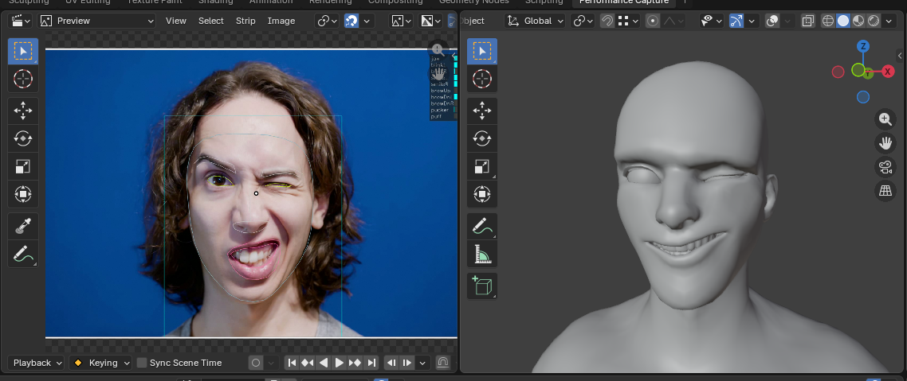
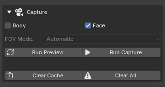
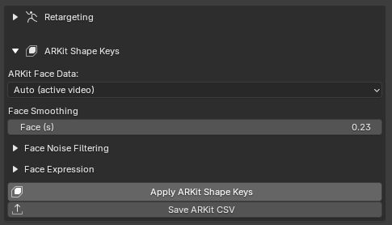
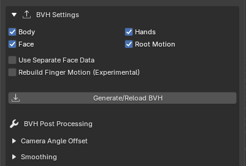
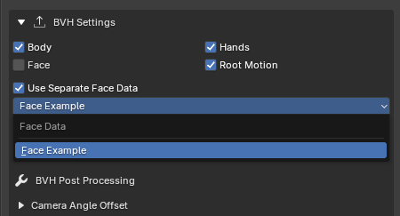
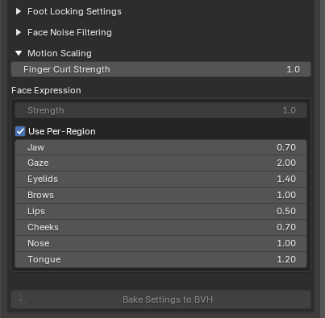

# Face Capture

BlendCap can capture facial performances from the same kind of ordinary video as the body, no head rig or markers needed. The captured data can drive **ARKit-style shape keys** on a shape-keyed mesh, or **face bones** on a traditional face rig, and you can capture it together with the body for something easy and quick, or separately from a dedicated face performance video to get a more detailed result.

---

## Capturing the face

In the **Capture** section, enable **Face**:

You can either capture **Face and Body simultaneously** from one clip, or capture the **Face on its own**, for example a close-up performance you'll combine with separate body motion (see Combining separate clips below).

For ideal facial capture the face should be **clearly visible, reasonably large in frame, and evenly lit** with little to no camera movement. A front to three-quarter angle works best. See [Filming Tips](13-filming-tips.md).

> **Head rotation comes from the body, not the face.** Face capture produces expression only; it does **not** track head rotation. Your character's head is oriented entirely by the body capture.

---

## Two ways to use the result

How you apply the captured face depends on how your character is set up:

- **ARKit shape keys**: if your character's face is driven by ARKit-compatible shape keys (the standardized 52-blendshape set used across many tools and characters), BlendCap can keyframe them directly on your mesh. No armature or bone map needed.
- **Face bones**: for bone-based face rigs, the captured expression is included in the generated armature and retargeted onto your rig's face bones, the same way body motion is retargeted onto body bones.

If your character supports both, the shape-key path usually gives the nicer result up-front, because the shapes are sculpted for that specific face, and shape keys are the values the tracker natively outputs, so nothing is lost in translation, but it's much less intuitive to clean up afterwards. The face bones BVH path pushes the same performance through a rig, and tends to lose a little bit of nuance, but is much easier to manually augment/clean up afterwards.

---

## Applying ARKit shape keys

The **ARKit Shape Keys** section lives just below the **Retargeting** section of BlendCap's menu.

1. Select the mesh object that carries your character's ARKit shape keys.
2. Set **ARKit Face Data**. **Auto (active video)** uses the face capture that matches your currently selected video source; you can also pick any cached face capture from the list.
3. Click **Apply ARKit Shape Keys**. BlendCap keyframes the matching shape keys across the clip and reports how many of the 52 ARKit shapes it found on your mesh. (The tuning sliders between the dropdown and the Apply button are covered in below in "Tuning the performance".)

> Your mesh needs shape keys with the standard ARKit names (`jawOpen`, `browInnerUp`, and so on) for BlendCap to find them. Most ARKit-ready characters use these names out of the box. If yours doesn't have them yet, [this free guide](https://pooyadeperson.com/the-ultimate-guide-to-creating-arkits-52-facial-blendshapes/) walks through creating all 52 shapes, and [Apple's reference](https://developer.apple.com/documentation/arkit/arfaceanchor/blendshapelocation) lists the exact names BlendCap matches.

### Exporting to other programs

**Save ARKit CSV**, the button just below **Apply**, writes the same weights to a **Live Link Face-style CSV** instead of keyframing them onto a mesh. Tools that read this format, such as Unreal Engine and MetaHuman, iClone, and various Unity plugins, can then drive a face from the capture directly. It runs the same smoothing, noise filtering and expression settings as Apply (covered in "Tuning the performance" below), and because it doesn't depend on a mesh, it always writes the full ARKit blendshape set rather than only the shapes your mesh happens to carry. Head and eye rotation columns are included for compatibility but left at zero, since BlendCap's face capture is expression only.

---

## Retargeting onto face bones

For a bone-based face rig, first make sure your tracked face clip is selected in the Sequencer, or set as your **File Path** clip. Then the face data can travel with the armature generation:

1. In **BVH Settings**, enable **Face** so the generated armature includes the facial motion, then **Generate/Reload BVH**.

2. Retarget as usual, the shipped presets for Rigify, Auto-Rig Pro and CloudRig include the face bone pairings for their default armature compositions.

Anchored face bones land where the capture puts them, relative to the head, no matter what else is driving them. The head bones this relies on are detected automatically, and can be overridden under **Retargeting ▸ Advanced** (see [Retargeting](09-retargeting.md)).

Set the face rest pose up as carefully as the body's (see [Matching rest poses](09-retargeting.md#matching-rest-poses)). The face aligns a little differently: every bone is positioned by location, in all three dimensions, so turn on **Include Location & Scale in Rest Pose** and bring each bone right up against the face, internal ones like the tongue included. Less intuitive than posing the body, but not difficult.

---

## Combining body and face from separate clips

If you recorded the body and the face as different clips (say, a wide shot for the body and a close-up for the face):

1. Capture the body clip with **Body** enabled and the face clip with **Face** enabled, you only need to track one part per clip, so you can switch the other toggle off if you'd like to save processing time.
2. With the body clip active, open **BVH Settings** and enable **Use Separate Face Data**, then pick the face capture from the dropdown.

3. **Generate/Reload BVH**. The armature now carries the body from one clip and the face from the other.

If the clips aren't the same length, the shorter clip simply holds its last pose for the remainder of the longer clip. Working in the Sequencer makes it easy to trim the two clips and sync up the performances first, see [Capturing](05-capturing.md).

---

## Tuning the performance

Faces are expressive and personal, so BlendCap gives you tuning control over eight specific regions: **Jaw, Gaze, Eyelids, Brows, Lips, Cheeks, Nose and Tongue**. The same three controls, **Face Smoothing**, **Face Noise Filtering**, and **Face Expression** scaling, appear on whichever path you're using: the **BVH Post Processing** and **ARKit Shape Keys** versions are covered in [BVH Generation and Post-Processing](08-bvh-generation-and-post-processing.md), and the retarget-time version under **Retargeting ▸ Advanced** in [Retargeting](09-retargeting.md).

You'll find the same **Face Expression** sliders in a few places, and they don't all work the same way. The **BVH Post Processing** and **ARKit** sliders scale the captured expression itself, only the motion the capture read for that region. The **Retargeting** sliders scale the face bones instead, where the regions aren't cleanly separate, a bone can carry motion from its neighbors. So scaling a region there grows that borrowed motion too: turn up **Tongue** and you also scale the tongue movement that's really just the jaw opening. Use the BVH or ARKit sliders to adjust expression strength precisely, and the Retargeting sliders for more general adjustments.

---

## Tips

- **Capture body and face together for convenience, separately for detail.** Together keeps lip-sync and head motion locked automatically; a dedicated close-up face clip gives the tracker more pixels to work with, and a more detailed result.
- **Use Face Expression scaling** rather than re-shooting if the overall performance reads too strong or too weak on your character.
- For shooting guidance, framing angles, occlusion, and lighting, see [Filming Tips](13-filming-tips.md).