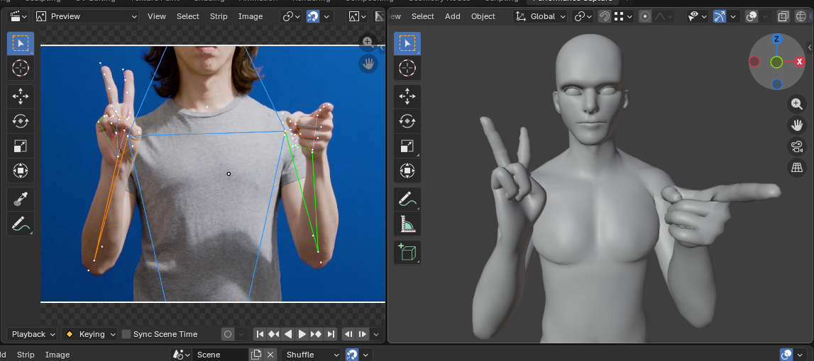
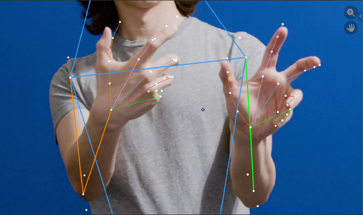
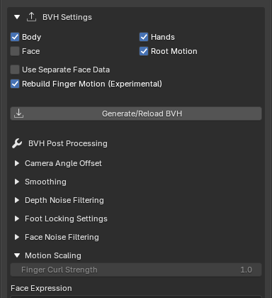

# Hand & Finger Tracking

This page explains what tools are available in BlendCap to capture and refine hand and finger detail from your footage. Hands are captured together with the body, there is currently no separate hand-capture mode.

---

## How hands are captured

Hands and fingers are part of the body model, not a separate tracker, so they come along automatically whenever you capture the body. Because the model reads the fingers off the body it detects, some of the body has to be in frame for the hands to track, an extreme close-up of just hands is unlikely to be detected or tracked.

**Refine Hand Tracking**, in [Preferences](11-preferences.md), is an optional extra pass at capture time that sharpens the finger poses. It runs automatically on NVIDIA hardware and is skipped on slower setups, but you can force it on or off in the preferences menu depending on your needs. The hands are captured either way, this only adds polish to the detail of the tracking itself.

Once you have your hand data captured, you have a few options to build on that data:

- The **Hands** toggle in **BVH Settings** sets whether finger bones are included in the generated armature at all. Turning it off leaves you with a fingerless armature, with only one bone extending from the wrists to control the general rotation of the hands.

- **Finger Curl Strength** (under **BVH Settings ▸ Motion Scaling**) amplifies the default finger motion that the capture produced while trying to maintain anatomically correct movement. By default capture averages out the tracked finger articulation and tends to underestimate how far fingers open or close, so raise this if fists/grips look too loose, or hands don't seem to open far enough. You can safely raise to around 3.00 - 4.00 without obvious artifacts depending on the capture. This is usually enough to sell an opening or closing fist but can't recover individual finger poses.

## Rebuilding finger motion

**Rebuild Finger Motion (Experimental)** (a toggle in **BVH Settings**, available when **Hands** is enabled) takes a different approach to the hands. It reconstructs each finger from the 2D tracked finger keypoints (the markers that you see in the overlay preview of your tracked footage) to recover distinct hand poses like a pointing finger or a counted "three". This almost completely replaces the default finger motion, and is not currently compatible with **Finger Curl Strength**.

**Rebuild Finger Motion** works best when the hand is reasonably large and clear in frame and roughly facing the camera. Frames where the hand is too small, blurred, or hidden fall back to the standard finger motion automatically, so it never makes those frames worse. Results are hard to predict and it struggles to reproduce certain poses and high levels of interaction, so give the results a look, and if Finger Curl Strength would leave you with less manual cleanup later, fall back to it instead.

> Although the body needs to be visible in order to track the hands, you can get a lot closer than normal to squeeze some extra detail and accuracy out of the finger articulation. Combining these separate hand-detail shots with a full-body wide shot (the way a dedicated face clip can be combined with the body today) is being considered for a future update.

Like the other post-processing controls, this applies when the BVH is generated, so it works on clips you've already captured, no re-capture needed, but it does cost extra processing time, and can be slow on longer clips.

> **Not the same as Refine Hand Tracking.** The **Refine Hand Tracking** preference (see [Preferences](11-preferences.md)) sharpens the hand *capture* itself, an extra pass at tracking time. **Rebuild Finger Motion** uses that data (refined or not) afterwards, replacing the default finger construction method when the BVH is generated.

---

## Filming for clean hands

Finger detail is only as good as what the camera delivers, so when the hands matter in a shot:

- **Keep the hands reasonably large and clearly visible.** Distant or tiny hands give the tracker little to work with; frame closer when you can.
- **Let the hands roughly face the camera** rather than pointing end-on at the lens, where a single camera has the least depth to read.
- **Avoid heavy motion blur.** Fast hand movement smears the finger detail; more light (and a faster shutter, if you have one) sharpens it.
- **Keep the hands unobscured.** Hands crossing behind the body or a prop drop out while they're hidden.

For general shooting guidance, see [Filming Tips](13-filming-tips.md).
