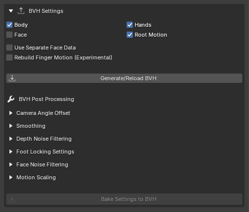
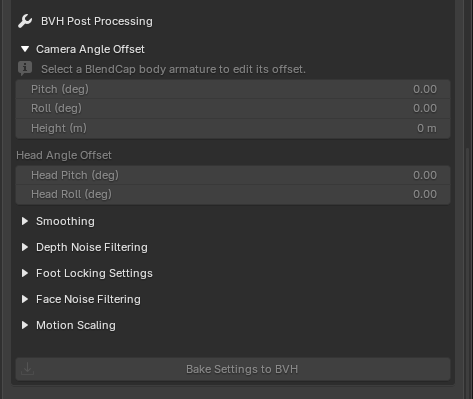
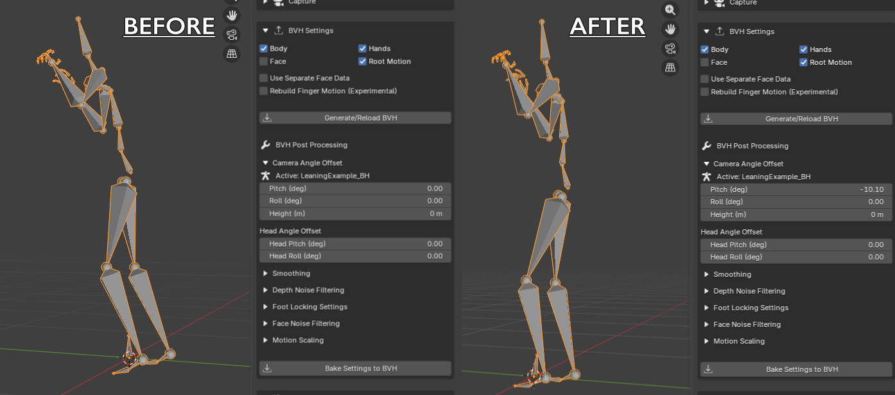
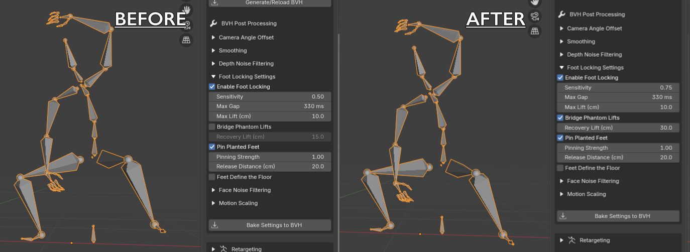
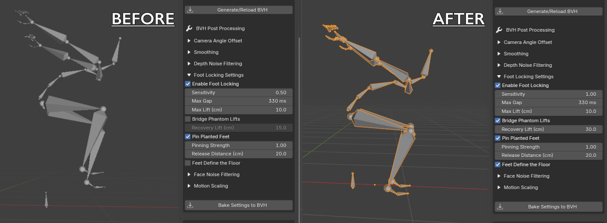
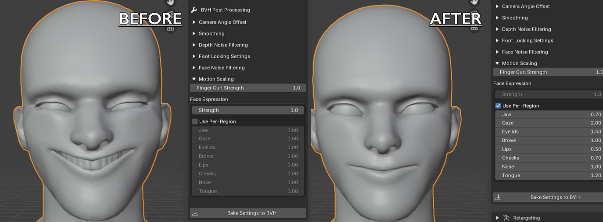

# BVH Generation and Post-Processing

A capture only produces tracking data. This is where you turn that data into an animated armature (a **BVH**) and clean it up: the **BVH Settings** section generates the armature, and the **BVH Post Processing** controls inside it shape the result.

---

## Generating the BVH

Expand the **BVH Settings** section, choose what the armature should include, and click **Generate/Reload BVH**. BlendCap builds the armature from your selected clip's capture and imports it into the scene.

The included toggles:

- **Body**: the full set of body bones.
- **Hands**: finger articulation.
- **Face**: facial motion as face bones (see [Face Capture](06-face-capture.md)).
- **Root Motion**: the actor's travel along the ground plane. Turn it off to generate the performance in place, for example when you'd rather animate the character's path yourself, or when a moving camera has bled its own travel into the capture.
- **Use Separate Face Data**: combine the selected clip's body with another clip's face capture (see [Face Capture](06-face-capture.md)).
- **Rebuild Finger Motion (Experimental)**: reconstruct the fingers from their tracked keypoints instead of the default finger motion, recovering distinct poses like a point or a counted number. Available when **Hands** is enabled; covered in full in [Hand & Finger Tracking](07-hand-tracking.md).

> **How generated armatures are named.** Each armature (and its BVH file in the library) is named after its clip plus letters for what it contains: `B` body, `H` hands, `R` root motion, `F` face, so `walk_BHRF` is a full export of the clip "walk", and a separate face capture shows as `walk_BH-closeup_F`. Re-generating with the same toggles **replaces** that armature in the scene, and overwrites the previous iteration's data on disk, while changing the toggles creates a differently named armature **alongside** the old one.

## Applying changed settings

Every post-processing control below is **baked in when the BVH is generated**, so after changing them, apply them in one of two ways:

- **Generate/Reload BVH** builds the armature for the **active clip**, and it's the only button that applies the toggles above. Use it for the initial generation, after a re-capture, or whenever you change which body parts or motion data the armature should include. It always starts fresh, so any camera-angle correction baked into a previous armature is not carried over.
- **Bake Settings to BVH** re-generates the **currently selected armature**. The armature's composition does not change, but any modified post-processing settings will be applied. The armature's source clip does not need to be active. This is the only button that writes the Camera Angle Offset sliders into the BVH file (each bake stacks on top of the last).

Post-processing only changes how the capture is cleaned up, it never re-runs the capture itself, so each re-generation is much faster than the capture stage. Experiment freely to find the right amount for each clip.

---

## Post-processing controls

Single-camera capture is never perfectly clean: feet slide and float, depth jitters, and the whole performance can come in tilted. These controls mitigate most of these issues without the need for manual cleanup.

---

## Camera Angle Offset

Sometimes a captured performance comes in tilted, the whole body leaning forward, back, or to one side. It's an occasional quirk of reconstructing 3D motion from a single camera. **Camera Angle Offset** straightens it, per armature, with a live viewport preview:

- **Pitch** and **Roll** tilt the whole body forward/back and side to side. Adjust until your character stands upright, the viewport updates as you drag.
- **Height** shifts the whole performance up or down, for when the floor level was misjudged and the character rides above or sinks below your floor.
- **Head Angle Offset** adds an extra **Head Pitch** / **Head Roll** for just the head bone, for when the head still reads as looking too far up or down after the body is corrected.

These sliders preview live on the selected armature; click **Bake Settings to BVH** to write them into the BVH file itself (which is what retargeting and exports read).

> **Baking stacks.** Each bake adds the current slider values on top of what's already baked into that armature, and the sliders reset to zero afterward. One thing to know: if you re-import a clip from your library, BlendCap can't read how much was previously baked into it, so the panel reminds you that the first bake on a re-imported armature starts fresh.

---

## Smoothing

Time-based smoothing that reduces frame-to-frame jitter, measured in **seconds** (0 = off). There are separate values for the **Face**, the **Body**, and the **Root**. A little goes a long way, too much and you start to lose the snap of fast motion, so start near the defaults and adjust until the jitter is gone but the performance still feels alive.

---

## Depth Noise Filtering

The trickiest axis for any single-camera system is **depth** (toward and away from the camera), there's simply less information there, so it's where most of the wobble lives. Depth Noise Filtering calms it while leaving real movement (steps, reaches) untouched.

There are separate strengths for the **Feet**, **Hands**, **Head**, and **Root** (the whole body's depth position), each measured in centimeters: motion smaller than the threshold is treated as noise and smoothed away, while larger, real motion passes through. It's on by default with safe values, increase a slider if a particular body part still shimmers in depth, or set it to 0 to leave that part untouched.

>If your character's entire body is randomly shifting by large amounts towards and away from the camera, try setting your capture's FOV mode to **Sample first frame only** and re-capturing (See [Capturing](05-capturing.md)), or turning off your BVH's **Root Motion** (See **Generating the BVH** above) instead of messing with depth noise filtering or smoothing settings. 

---

## Foot Locking

Usually the most valuable cleanup step: it detects when a foot is in contact with the ground, pins it to the floor, and helps to remove the sliding ("footskate") or jittery vertical motion in the feet. **Enable Foot Locking** is on by default, and its settings live in the **Foot Locking Settings** sub-section:

> Note that these settings will help remove footskate from the feet themselves, but cannot repair any sliding that comes from the armature's root motion, which needs to be cleaned up manually if present.

- **Sensitivity**: how aggressively BlendCap decides a foot is in contact with the ground. Higher values catch more contacts (good for footage with lots of held poses); lower is more conservative (good when there are lots of genuine quick steps). It's also the fix for floating feet: a contact that drifted off the floor can sit too high for the detector to recognize it as one, which is exactly what keeps it from being corrected, and a higher setting widens what counts so grounding can catch it and pull it back down.
- **Max Gap**: any contacts closer together in time than this (in seconds) are merged into one continuous contact.
- **Max Lift**: any lifts that go higher than this value (in cm) between contacts will be considered a real footstep or leg lift, and will not be merged.
- **Bridge Phantom Lifts**: bridges the gaps Max Gap can't: with this on, a contact can break for _any_ length of time and still be merged, as long as the foot stayed low and came back down in the same spot, a sign the tracker lost the contact rather than the foot really stepping. The **Recovery Lift** value sets how high the foot can rise while still being treated as one of these misreads.
- **Pin Planted Feet**: once a contact is detected, this is what actually holds the foot still so it doesn't slide. It's on by default; turn it off to let the feet keep more of their original motion through a contact. **Pinning Strength** sets how firmly a planted foot holds its spot, lower values let some of the original movement through. **Release Distance** unpins a contact when the foot drifts farther than the set distance from where it planted; this allows you to free a genuine slide that was mistaken for a plant.

- **Feet Define the Floor**: keeps the character on the ground plane while trying to conserve jumps. Feet in contact with the ground stay pinned to it, jumps and crouches are told apart by whether the body rises on screen in the source video, and jump heights are calculated from the time spent in the air. Works best with **Capture Skip** at 0. Helps with fixing floating captures or knees not bending enough. **Weaknesses**: if camera motion follows a jump this setting may not detect it properly, and feet dangling in the air during seated or hanging positions can be mistaken for standing or squatting.

### Suggested starting points
- **Lots of dynamic movement and held poses:** raise **Sensitivity** to about 0.75, turn **Bridge Phantom Lifts** on, and raise **Recovery Lift** to about 30 cm.
- **Lively footwork with short quick steps:** keep the defaults, they're deliberately conservative so they don't lock a foot that's genuinely moving.
- **Feet floating during holds and deep squats:** raise **Sensitivity** and/or enable **Feet Define the Floor**. 
- **Knees appear stiff (stuck either straight or in a permanent bend)**: Lower **Sensitivity** to around 0.2, and disable **Feet Define the Floor**.

---

## Face Noise Filtering & Motion Scaling

The last two sub-sections tune the **face** and the **fingers**. Face tuning is per-region, across eight regions: **Jaw, Gaze, Eyelids, Brows, Lips, Cheeks, Nose and Tongue**. (Face smoothing lives with the other Smoothing sliders above, and the **ARKit Shape Keys** section carries identical copies of these controls for shape-key faces, see [Face Capture](06-face-capture.md).)

### Face Noise Filtering
Snaps very small movements to zero, per region, so a trembling jaw or flickering eyes go quiet without deadening real expressions. Raise a region's value only as far as needed to kill its jitter. Very small values usually work best here (around 0.05 - 0.2).

### Motion Scaling

**Finger Curl Strength** amplifies finger curl. By default capture tends to underestimate how far fingers open or close, so raise this if fists/grips look too loose, or hands don't seem to open far enough. Can safely raise to around 3.00 - 4.00 without obvious artifacts depending on the capture. It's disabled while **Rebuild Finger Motion** is active (see [Hand & Finger Tracking](07-hand-tracking.md)). 

**Face Expression** scales the strength of the facial performance: **Strength** scales everything uniformly, or turn on **Use Per-Region** to push or pull each region independently, this lets you exaggerate the eye movement of a character with larger eyes, or soften the mouth movement of characters with a smaller jaw/mouth, or selectively tone down a performance that was exaggerated for tracking. Values above 1 amplify, below 1 soften. Generally looks best within the 0.5 - 1.5 range. **Tongue** is a length dial: capture reports a tongue-out at full strength, so this sets how far your character's tongue actually travels. On the BVH path, **Use Per-Region** ships on with tuned starting values for each region, so you're fine-tuning a sensible baseline rather than dialing in from scratch.

> These bake into the exported BVH (and the ARKit versions into the keyed shape keys), so the cleaned-up, scaled result travels with the file into other programs.

> The same **Face Expression** sliders also live under **Retargeting ▸ Advanced**, but they work differently there, scaling your rig's face bones rather than the captured expression. That's blunter, since a bone can carry motion from its neighbors, so use these here to adjust expression strength precisely, and the Retargeting ones for more general adjustments. See [Retargeting](09-retargeting.md).

---

## Recommended order

A good default cleanup pass:

1. **Camera Angle Offset**: get the character standing upright first.
2. **Smoothing**: calm the overall jitter (usually the default values are fine).
3. **Depth Noise Filtering**: settle the depth wobble (again, usually the default values work fine).
4. **Foot Locking**: plant the feet last, so it works on already-clean motion.

You don't have to use all four on every clip, reach for the ones a given capture needs.