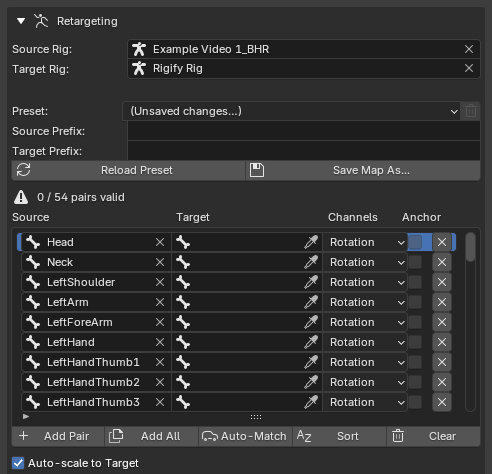
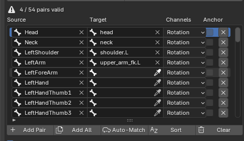
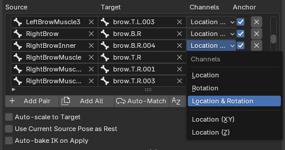
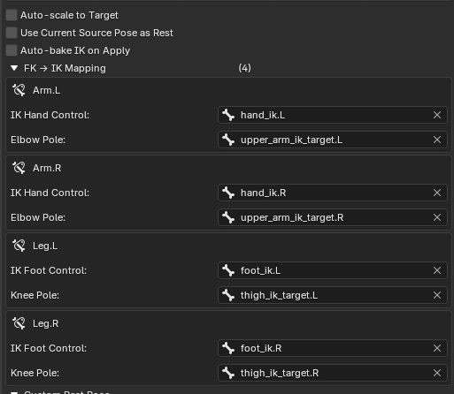
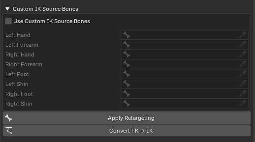
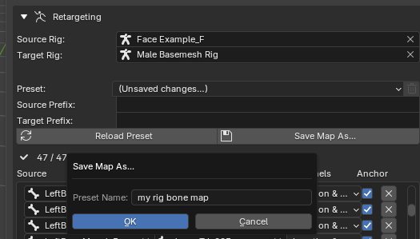

# Retargeting

Retargeting is how the captured motion gets onto **your** character. BlendCap bakes the performance from the captured armature onto your rig's controls in FK, and can optionally convert the result onto your rig's IK controls.

---

## Supported rigs

BlendCap ships with presets for the most common Blender rig types, and works with custom rigs through its bone-map editor. The preset maps can be used as they are with standard setups, or used as a base for modified rigs, and saved as a new custom map afterwards for later use:

- **Rigify** (with presets for both the new and old face systems)
- **Auto-Rig Pro**
- **CloudRig**
- **Mixamo** skeletons and control rigs from the **Mixamo Control Rig** Addon
- **Your own custom rig**: map it once in the bone-map editor and save it as a preset for a faster setup next time.

> There is also a set of **Mixamo-source** presets (Mixamo → Rigify, Mixamo → Auto-Rig Pro, etc.) for transferring an animation from the Mixamo library onto one of the supported rigs, no capture involved.

---

## Step 1: Assign Source and Target

In the **Retargeting** section you'll see:

- **Source Rig**: the captured armature BlendCap imported, or another armature with animation data you would like to retarget.
- **Target Rig**: The rig you would like to apply the animation data to.

>When you assign a rig, BlendCap tries to do some automatic setup behind the scenes (for example detecting the head bones for facial transfer), so assign both before building the bone map.

## Step 2: Build the bone map

The **bone map** tells BlendCap which captured bone drives which bone on your rig. Each row pairs one **source** bone with one **target** bone.

Three ways to fill it in:

### Option A: Load a preset (easiest)
Open the **Preset** dropdown and pick the one that matches your rig; it loads instantly. Presets are listed in two groups, the built-in **Standard Presets** (read-only) and your own saved **Custom Presets**.

If some pairs light up red after loading, those bones weren't found on your rig, usually a naming difference. Fix the individual pairs, or see Prefixes below; the red rows simply do nothing until they resolve, so a few missing fingers won't break the bake.

### Option B: Auto-Match
Click **Auto-Match** to have BlendCap pair up bones by name. Great for custom rigs that follow common naming conventions.

### Option C: Map by hand
**Add All** fills the table with every source bone in BlendCap's standard order, or **Add Pair** adds rows one at a time; pick the target bones yourself. Use this to set up a custom rig or fix individual pairings.

>The standard order, shared by the presets, **Add All** and the **Sort** button, reads top-down like the rig: **face** first (feature by feature: brows, then eyelids and eyes, ears, cheeks, then the nose–mouth–jaw–tongue cluster), then **head and neck**, the **left arm** then **right arm** (shoulder to hand, fingers thumb to pinky), the **spine** from its top down to the hips, the **left leg** then **right leg** (thigh to toes), and finally any bones BlendCap didn't recognize, kept in the rig's own order. Limb chains stay together parent-to-child, so each block reads as one continuous chain.

### Working with the table
- **Search**: the filter field finds pairs by source *or* target name.
- **A-Z**: sorts the view alphabetically (display only).
- **Sort**: reorders the table itself into the standard order described above, handy after hand edits have scrambled it.
- **Clear**: empties the table to start over.
- The header shows **how many pairs are valid** against the current rigs, a quick health check before you bake.

### Per-pair options
Each row has a **Channels** dropdown choosing what gets copied, **Rotation** (the usual choice for most bones), **Location**, **Location & Rotation**, or location limited to certain axes, and an **Anchor** checkbox for face bones. Anchoring makes a bone land exactly where the capture puts it, relative to the head, regardless of what the rest of the rig is doing to it, which matters because every rig wires its face differently (a lower lip often rides the jaw, for example). The shipped presets set these where they're needed, and they're available per pair when you're mapping your own rig.

>To place bones relative to the head, BlendCap needs to know which bone is the head on both rigs: the **Head (Source)** and **Head (Target)** fields under **Advanced** are detected automatically when you assign your rigs, and you can point them at the right bone by hand if your rig uses an unusual name.

The **Advanced** dropdown holds a **Face Expression** block for scaling the facial performance at retarget time: **Strength** scales every face bone uniformly, or **Use Per-Region** pushes or pulls each of the eight face regions (**Jaw, Gaze, Eyelids, Brows, Lips, Cheeks, Nose, Tongue**) independently. Unlike the **BVH Post Processing** and **ARKit** sliders, these scale the face bones on the current rig rather than the captured expressions, and nothing is written back into the BVH. On the bones the regions aren't cleanly separate, a bone can carry motion from its neighbors, so scaling one region grows that borrowed motion too: turn up **Tongue** and you also scale the tongue movement that's really the jaw opening, not captured tongue. Use the BVH sliders to adjust expression strength precisely, and keep these for more general adjustments. Values above 1 amplify motion, below 1 soften. Generally looks best within the 0.5 - 1.5 range.

---

## Prefixes: re-aim a whole map at once

Many rigs share a naming scheme but add a namespace prefix (`mixamorig:`, `rig:` etc.). The bone map stores **short names**, and the **Source Prefix** / **Target Prefix** fields prepend to every row at bake time.

BlendCap detects the prefixes automatically when a preset loads, and you can edit them yourself: change one field and the same map retargets a rig whose bones are namespaced differently, no row edits needed.

---

## Step 3: Apply Retargeting

Check these two toggles above the button if needed, then click **Apply Retargeting**:

- **Auto-scale to Target** compensates for size differences between the captured armature and your character.
- **Use Current Source Pose as Rest** treats the source armature's current pose (manually adjusted before retargeting) as its rest pose, this is how you line up rest poses by hand (see "**Matching rest poses**" below).

BlendCap bakes the performance onto your rig's FK controls, with a progress bar and a Cancel button for long clips. When it finishes, scrub the timeline and your character performs the clip.

> BlendCap's retargeting engine simulates the rig in pure math rather than using Blender's constraint system or evaluating the scene frame by frame, so even complex rigs bake quickly. But longer clips can still take some time to load.

---

## Step 4: Convert to IK (optional)

If your rig has IK arms and legs, converting the FK result to IK gives you proper hand and foot targets, which is generally what you want for final cleanup.

- Click **Convert FK → IK** after the retarget finishes, or enable **Auto-bake IK on Apply** to have it run automatically as part of Apply Retargeting.
- The **FK → IK Mapping** sub-section shows the IK chains BlendCap discovered on your target rig, one row per limb, with fields for each limb's **IK control** (the hand or foot controller) and its **pole** (the elbow or knee direction control). Presets fill these in for the supported rigs; on a custom rig, point each field at the right controller bone once.

> IK conversion reads from your rig's baked FK pose, so it always runs **after** the FK retarget. If you let BlendCap auto-convert, it handles the ordering for you. These settings can be stored in your custom bone map presets as well.

For unusual **source** armatures (not generated by BlendCap), the **Custom IK Source Bones** table under **Advanced** lets you tell the converter which source bones are the hands, feet, forearms and shins.

---

## Matching rest poses

Retargeting is cleanest when the source armature and your character start from the same rest pose. Two tools in BlendCap can handle this:

- **Use Current Source Pose as Rest**: manually pose the source armature to match your character's rest pose in Pose Mode, then enable this toggle.

>Make sure both the target and source are occupying the same space in object mode, and start from BlendCap's default rest pose by entering pose mode with the source armature selected, and clearing all transforms with **alt+g**, **alt+r**, and **alt+s**

- **Custom Rest Pose**: the saved-preset version. Open the **Custom Rest Pose** sub-section, enable **Use Custom Rest Pose**, and pick a preset, the bundled **T-POSE** and **A-POSE** presets cover the most common cases. You can **Preview Selected Pose** to see it applied, and **Save Current Pose as Preset** to capture your own rig's pose for future reuse.

The two are mutually exclusive (turning one on turns the other off), and neither changes your captured animation, they only set what BlendCap treats as the source's rest pose.

By default a rest-pose override takes only **rotation** from the pose. **Include Location & Scale in Rest Pose**, under **Retargeting ▸ Advanced**, tells BlendCap to use the pose's location and scale as well (it's greyed out unless one of the two rest pose options above is active). Leave it off for ordinary body matching, where you pose by rotation alone. Turn it on when the rest pose actually moves or scales bones. 

For **face rigs**: face bones are positioned by location, so matching a face rest pose with rotation only does almost nothing. It also matters when you've scaled bones by hand to fit an unusual target rig. When you **Save Current Pose as Preset**, the state of this checkbox is saved into the preset, so choosing that preset later restores it automatically, each preset carries its own intent.

---

## Working with capture data from other sources

**Read Source Location in World Space** (also under **Advanced**) changes how source-bone location is sampled, using world space instead of the bone's local basis. It's an escape hatch for source rigs whose object has a non-identity transform, most commonly **Mixamo** rigs, which sit at a different object scale. If a Mixamo (or similarly transformed) source gives wrong translation on location-mapped bones, enable this; ordinary BlendCap-generated sources don't need it.

---

## Saving your own bone maps

Mapped a custom rig? Click **Save Map As...** and your map appears under **Custom Presets** in the preset dropdown, ready to reuse on the next capture. The map saves everything: pairs, prefixes, IK mapping, and the face settings.

If you edit a loaded preset, the dropdown switches to **(Unsaved changes…)** to remind you the live map has drifted from the saved file, save it (or **Reload Preset** to go back). BlendCap's bundled presets are read-only, saving always creates your own copy. Custom presets are stored in BlendCap's installation folder.

---

## Tips

- **Start from the closest preset**, then fix a few pairs by hand rather than mapping from scratch.
- **Assign both rigs before loading the preset**, so the automatic prefix and head-bone detection can do its job.
- **Save custom maps**, a one-off rig becomes a one-click preset next time.