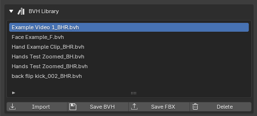

# BVH Library & Cache

BlendCap keeps your captures organized so you can re-use them, export them, and free up space when you're done. Two pieces do that work: the **BVH Library** (your finished, reusable takes) and the **cache** (the raw working data behind each capture).

---

## The BVH Library

Every armature you generate is saved as a **BVH file** in the library, and the **BVH Library** section at the bottom of the panel lists them. Select one and:

- **Import** brings it back into the scene, without re-running the capture. Handy for retargeting the same performance onto a different character, or coming back to a clip later.
- **Save BVH** saves a copy of the BVH file wherever you choose, for use in any program that reads BVH.
- **Save FBX** converts it to an FBX file, for game engines and other software that prefer FBX.
- **Delete** removes it from the library (it asks you to confirm first).

By default the library lives in a `bvh_exports` folder inside the project's cache, and you can point it somewhere else, including one shared folder that several projects read from, with the **BVH library folder** preference (see below).

---

## The cache

When you capture a clip, BlendCap stores the raw intermediate results, the tracking data and the preview overlay, in a **cache folder** for that clip. This is what makes re-captures faster, and allows you to generate the BVH multiple times with different post-processing settings while the slow capture step only has to run once.

BlendCap also remembers **which settings** produced each cached result. If you change anything capture-affecting (the frame range, capture backend, hand refinement, FOV mode, capture skip), it notices and will clear the cache the next time you run the capture, so you never get a stale result that doesn't match your settings. If you suspect a stale result anyway, you can always clear the cache manually (see below).

### Where it's stored

- For a **saved** project, the cache is a `Blendcap_Cache` folder next to your `.blend` file, so it travels with the project.
- For an **unsaved** project, it goes to a temporary folder that is **cleared when Blender closes**. Save the project and BlendCap automatically moves the cache in next to the new `.blend` file, so capturing first and saving after is safe, just save before you quit. 

>You can change where your cache is stored by default in [Preferences](11-preferences.md).

---

## Clearing space

The **Capture** section gives you two cleanup buttons to help work around unexpected bugs:

- **Clear Cache** removes the current clip's cached data, so its next capture runs fresh. Use it if you ever suspect a stale result.
- **Clear All** removes every clip's cache in the project, reverts any capture strips in the Sequencer back to the original videos, and removes the preview overlays from the viewport, allowing you to start completely fresh.

> Both are safe by design: they only ever delete inside the `Blendcap_Cache` folder BlendCap owns, and **your BVH Library is not affected**, finished takes stay. If you're worried about hitting **Clear All** by accident, you can hide the button in [Preferences](11-preferences.md).