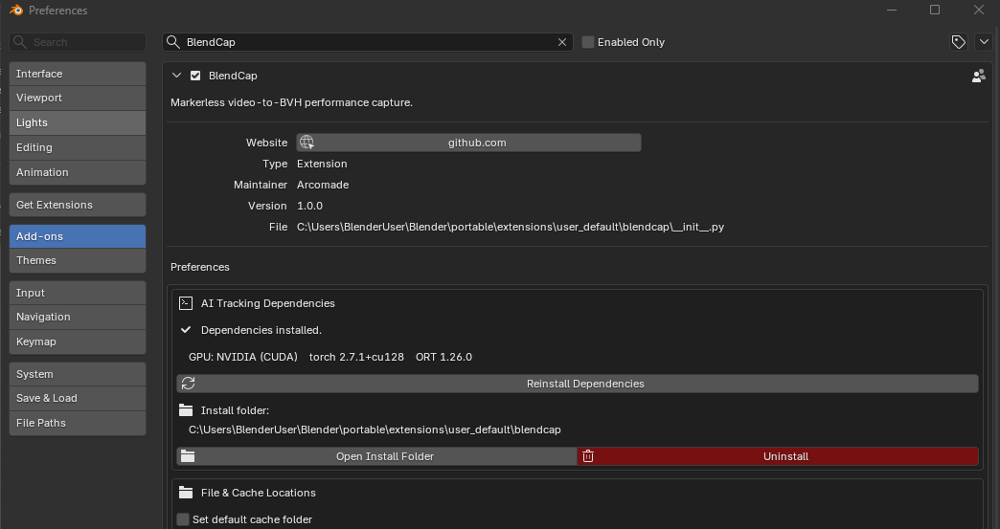

# Preferences

BlendCap's preferences can be found in **Edit ▸ Preferences ▸ Add-ons ▸ BlendCap**. They apply to your whole Blender install (not per-project), so you set them once. The quickest way there is the **Open Preferences** button in the Setup section of BlendCap's sidebar panel.

The preferences are grouped into four sections.

---

## AI Tracking Dependencies

Manage the models and libraries BlendCap needs. When everything is installed, this section confirms it and lists what was detected (your GPU and the installed library versions), for reference and support questions.

| Control                  | What it does                                                                                                                                                                                                                            |
| ------------------------ | --------------------------------------------------------------------------------------------------------------------------------------------------------------------------------------------------------------------------------------- |
| **Install Dependencies** | Runs the one-time setup (see [Installation](03-installation.md)). Shows as **Reinstall Dependencies** once they're installed, re-run it after a GPU change or an interrupted install.                                                   |
| **Open Install Folder**  | Opens the folder where BlendCap and its dependencies live on disk (the path is shown above the button).                                                                                                                                 |
| **Uninstall**            | Removes the bundled Python environment and downloaded AI models to free disk space (several GB). A confirmation appears first; Blender may freeze briefly while files are removed, and you'll need to reinstall before capturing again. |

---

## File & Cache Locations

Choose where BlendCap stores its data (covered in [BVH Library & Cache](10-bvh-library-and-cache.md)).

| Control | What it does |
|---|---|
| **Set default cache folder** | Save tracking data to a folder you choose instead of the temporary folder, so captures made in unsaved projects survive closing Blender. Saved projects still keep their cache next to the `.blend` file unless you also tick **Always use this folder**. |
| **Use a custom BVH library folder** | Read and save the BVH library from a folder you choose. Point several projects at one shared folder to reuse takes across them. |

Changing a location doesn't move existing data, new captures use the new location.

---

## Capture & Tracking

Settings that affect how captures run.

### Capture Backend

Which hardware runs the body capture. **Automatic** suits almost everyone, it uses whatever the installer detected, and a line below the dropdown shows what that was. The rest are manual overrides (see [System Requirements](02-system-requirements.md) for supported hardware).

| Backend                                               | Use it when                                                                                                                                                                                                                                                                                                                                                              |
| ----------------------------------------------------- | ------------------------------------------------------------------------------------------------------------------------------------------------------------------------------------------------------------------------------------------------------------------------------------------------------------------------------------------------------------------------ |
| **Automatic (use what was detected at installation)** | Recommended. If you've changed GPUs since installing, run **Reinstall Dependencies** so detection is refreshed.                                                                                                                                                                                                                                                          |
| **NVIDIA - CUDA**                                     | Force the NVIDIA engine: the fastest, most accurate, fully supported path.                                                                                                                                                                                                                                                                                               |
| **Non-NVIDIA - DirectML / ONNX (experimental)**       | Force the DirectML path for AMD/Intel GPUs. Slower, slightly less accurate, and experimental.                                                                                                                                                                                                                                                                            |
| **CPU Only (no GPU - very slow)**                     | Run capture entirely on the CPU. Works on almost any machine and avoids GPU out-of-memory crashes, but expect minutes per frame. If the fast-CPU component isn't already installed (for example, after switching from an NVIDIA install), the first CPU capture downloads it once (~1.7 GB) when online; without it, capture still completes on an even slower fallback. |

### Other capture settings

| Control                        | What it does                                                                                                                                                                                                                                                                                                                                                              |
| ------------------------------ | ------------------------------------------------------------------------------------------------------------------------------------------------------------------------------------------------------------------------------------------------------------------------------------------------------------------------------------------------------------------------- |
| **Refine Hand Tracking**       | An extra capture pass that sharpens finger poses. **Automatic** (default) refines on NVIDIA and skips it on non-NVIDIA/CPU, where it's slow; **Always on** for best hands everywhere; **Always off** for speed. Hands are still captured either way, this pass only adds polish, and whether hands appear in the armature at all is the **Hands** toggle in BVH Settings. |
| **Default Source**             | Which video source new projects start on: **File Path** or **Video Editor Strip**. Set it to Video Editor Strip if you usually capture from the timeline. Choosing Video Editor Strip asks whether new files should have Blender's Sequencer render option turned off automatically (see **Sequencer Render Warning** below).                                                                                                                                                                                                                 |
| **Sequencer Render Warning**   | What to do about Blender's "Sequencer" render option when you switch the source to a Video Editor strip (leaving it on can make renders export your source clip instead of the scene): **Ask each time** (default), **Turn off automatically**, or **Leave it alone**. **Turn off automatically** also covers new files that start on a Video Editor strip through **Default Source**; saved projects keep their own setting. **Ask each time** isn't available while Default Source is Video Editor Strip, new files start on a strip with no switch to ask on. See [Capturing](05-capturing.md).                                                                  |
| **Disable playhead auto-snap** | Keep the timeline playhead where it is when a capture starts, rather than jumping to the start of the selected clip.                                                                                                                                                                                                                                                      |

> **Refine Hand Tracking is not Rebuild Finger Motion.** This preference sharpens the hand *capture* itself, an extra pass at tracking time. **Rebuild Finger Motion** (in BVH Settings) is a separate control that reshapes the fingers afterward, to retain as much detail as possible when the BVH is generated. See [Hand & Finger Tracking](07-hand-tracking.md).

---

## Interface

Tailor the BlendCap panels to your taste. Both toggles apply instantly.

| Control                               | What it does                                                                                                                                                                         |
| ------------------------------------- | ------------------------------------------------------------------------------------------------------------------------------------------------------------------------------------ |
| **Hide the Setup section**            | Hides the Setup box at the top of the sidebar panel once you're past first-time setup, and if you don't need the **Open Workspace** button.                                          |
| **Hide the "Clear All" cache button** | Hides **Clear All** so the whole capture cache can't be wiped by accident, **Clear Cache** (current clip only) stays available. Useful when several projects share one cache folder. |

This section also walks you through keeping the **BlendCap workspace** available in every new project: open the workspace once from the sidebar's Setup section, then use **File ▸ Defaults ▸ Save Startup File**. It's best done from a fresh project, since the startup file saves your entire scene. The section shows where the startup file lives (with an **Open Folder** button), and deleting that file reverts Blender to its default startup.