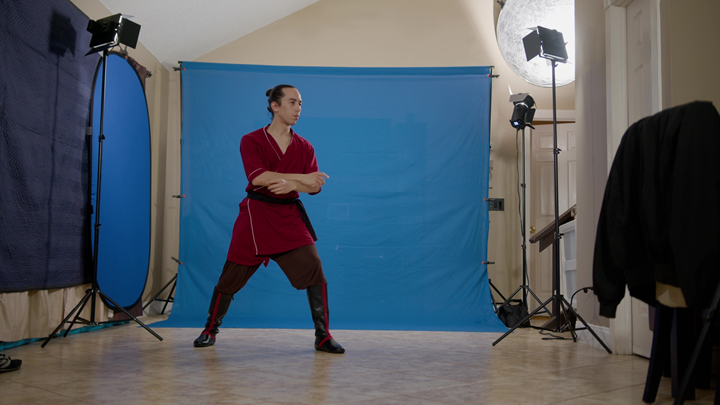

# Filming Tips

BlendCap can only capture what the camera saw, so a few minutes of care when you record pays off more than any setting. This page is a practical checklist for shooting footage that captures cleanly, based on how BlendCap's tracking models actually behave.

---

## The essentials

- **One person in frame.** BlendCap tracks a single subject per capture: it locks onto the main person and follows them between frames, and other people in the shot can steal that lock (it warns you when it keeps seeing more than one). Keep others out of frame, or at least small, far away, and never overlapping your subject.
- **Keep the whole body in frame** for body capture, head to feet, with a little margin. The body model handles a partly hidden body well, but foot grounding needs to *see* the feet, if they leave the frame, planting and floor contact have nothing to work with.
- **Bright, even light.** Good light helps every stage, the person detector, the body model, and especially face tracking. Avoid strong backlight.
- **Hold the camera steady.** A tripod is ideal. BlendCap captures motion relative to the camera, so shake reads as jitter and a moving shot mixes the camera's travel into the character's motion. Camera tilt may cause subjects to lean forwards or backwards, but can be corrected with **Camera Angle Offset** later. Footage from a moving camera is still usable, but you may have to generate the armature without **Root Motion** and animate the character's travel manually (see [BVH Generation and Post-Processing](08-bvh-generation-and-post-processing.md)).
- **A clean background helps detection.** The body model is built for messy real-world footage, but the person detector still has to find your subject, and mannequins, posters and other people confuse it more than ordinary clutter does.

---

## Occlusion: brief is fine, long is not

The body model is robust to partial occlusion, a hand crossing the torso, a prop in front of a leg, and BlendCap rides through brief full losses by re-using the subject's last known position. What can't be captured is a subject hidden or out of frame for long stretches, those frames simply have nothing in them. When in doubt, run a **Preview** to check detection coverage before committing to a long capture, see [Capturing](05-capturing.md).

---

## Framing & camera position

- **Give the performance room.** Let the subject have some free space in the frame rather than filling every pixel. Keep a bit of headroom and footroom so the body stays entirely in frame through the whole take for an ideal capture.
- **Avoid fisheye and heavy lens distortion.** BlendCap estimates the camera's field of view assuming a normal, undistorted lens; strongly distorted footage skews the depth estimate. A standard phone lens is fine, the ultra-wide one less so.
- **Keep the shot static, and if you must zoom, tell BlendCap.** Pans and handheld drift bake into the motion (see above), and a zoom changes the field of view mid-clip, set **FOV Mode** to sample every frame if your footage has zooms (see [Capturing](05-capturing.md)).

---

## The subject

- **Normal clothing is fine, extremes aren't.** The body model is trained on a huge variety of real-world clothing, but very loose or flowing garments (robes, long dresses) hide the pose underneath and can confuse the prediction. Also avoid outfits that blend into the background.
- **Expect depth to be the noisy axis.** Toward-and-away-from-camera is the hardest thing for any single camera to judge, that's what **Depth Noise Filtering** exists for. Motion *across* the frame will always read more cleanly than motion straight at the lens.

---

## For face capture

Face tracking is pickier than body tracking, it needs detail the camera has to actually deliver:

- **Get the face large and clear in frame.** A small, distant face degrades tracking quality, a close or medium shot is far better. Fine mouth and teeth detail needs the most size, in wide full-body shots BlendCap automatically falls back to simpler face tracking. For the most detail, shoot the face as its own closer clip and combine it with the body (see [Face Capture](06-face-capture.md)).
- **Stay within a three-quarter view.** Face tracking loses the face beyond roughly 80° away from the camera, a profile shot won't track.
- **Keep the face unobstructed.** Tracking fails outright when less than half the face is visible, and hands, hair and props crossing the face degrade it well before that.
- **Light the face and keep it steady.** Dim, noisy or blurry footage shows up as jitter in the tracked face. Face Smoothing and Noise Filtering can clean it up, but cleaner footage needs less of them.
- **Keep other faces away from your subject's.** The face tracker expects one face in its search area, someone overlapping or right beside your subject can confuse it.
- **Perform expressions clearly.** Motion the camera can barely see may read as flat (cheeks especially). Performing slightly big and pulling it back later with **Face Expression** scaling beats re-shooting.

---

## Technical settings

- **Color space: standard sRGB/Rec.709.** BlendCap reads your footage as ordinary video, so log picture profiles (S-Log, V-Log, C-Log and the like) and HDR footage reach the tracker flat and washed out, which noticeably hurts tracking quality. Shoot in a standard profile, or convert/grade the clip to Rec.709 before capturing, it makes a bigger difference than you'd expect.
- **Frame rate:** match (or convert to) your scene's frame rate. BlendCap offers the conversion for you, see [Capturing](05-capturing.md). Be wary of Blender automatically changing your project's frame rate based on the first clip you drop on the timeline.
- **Resolution:** a clear, well-exposed 1080p clip is plenty. Higher resolution costs processing time and memory during capture without rescuing poor light or framing.
- **Shutter:** nothing special required, a standard 180° shutter captures fine. A faster shutter can sharpen fast motion a touch, but isn't typically necessary.

---

## Quick pre-shoot checklist

- [ ] One person, whole body in frame, feet included, with margin
- [ ] Even, bright lighting; no strong backlight
- [ ] Camera steady (tripod)
- [ ] Background reasonably clean; clothing distinct from it, not overly loose
- [ ] For face: face large in frame, unobstructed, within a three-quarter view
- [ ] Standard color profile (sRGB/Rec.709), no log or HDR
- [ ] Frame rate matches your project

Get these right and most of the cleanup work is already done before you capture.